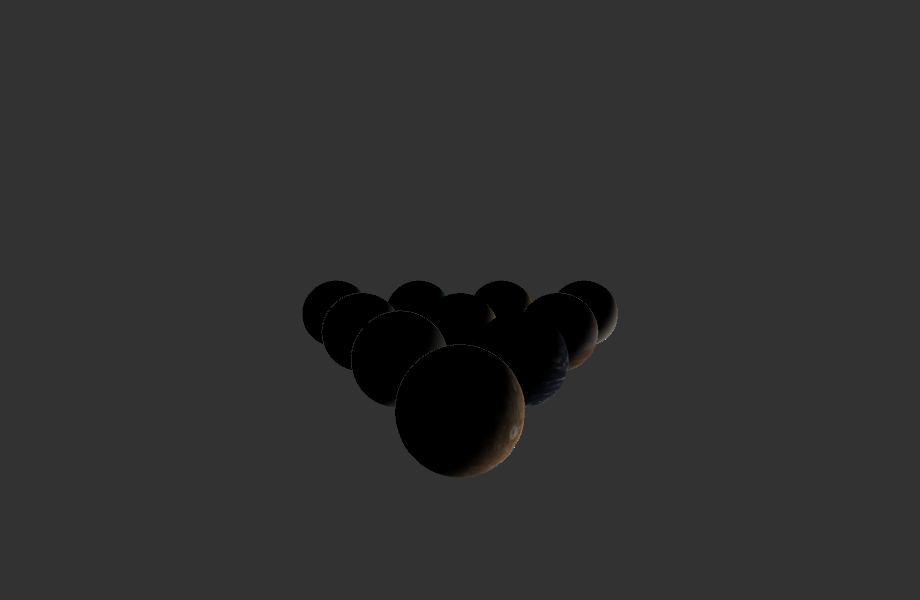

<!-- TABLE OF CONTENTS -->
<details open="open">
  <summary>Tabla de contenidos</summary>
  <ol>
    <li>
      <a href="#Autor">Autor</a>
    </li>
    <li>
      <a href="#Trabajo realizado">Trabajo realizado</a>
    </li>
    <li><a href="#decisiones-adoptadas">Decisiones adoptadas</a></li>
    <li><a href="#referencias">Referencias</a></li>
    <li><a href="#herramientas">Herramientas</a></li>
    <li><a href="#resultado">Resultado</a></li>
  </ol>
</details>


## Autor

El autor de este proyecto es el estudiante Alejandro Daniel Herrera Cárdenes para la asignatura Creando Interfaces de Usuario (CIU) para el profesor Modesto Fernando Castrillón Santana. 


## Trabajo realizado

El trabajo se basa en hacer una escena con iluminación. En esta práctica aproveché las prácticas anteriores e hice como la forma de las bolas de billar con el sol en el centro.

## Decisiones adoptadas

Las mayores decisiones tomadas y las que mas pruebas requirieron fue la colocación de los planetas y la iluminación.


* Metodos que manejan tanto la cámara como la iluminación.
  ```
  void setCamera() {
    if (pause) camera(width/2.0, height/2.0, (height/2.0) / tan(PI*30.0 / 180.0), width/2.0, height/2.0, 0, 0, 1, 0);
    else camera(posCam.x, posCam.y, posCam.z, x, height/2.0, 75*8+20, 0, 1, 0);
  }

  void lightControl() {
    if (lightUp) light = (light < 5000)? light+40 : 5000;
    if (lightDown) light = (light > -5000)? light-40 : -5000;
  }

  void setLight() {
    float val = (float)light/(float)width*float(255);
    ambientLight((int)val, val, val);
    pointLight(204, 153, 0, light, height/2, 400);
  }

  void cameraControl() {
    if (rotateRight) {
      camMov--;
      camMov %= 360;
    }
    if (rotateLeft) {
      camMov++;
      camMov %= 360;
    }
    if (zoomOut) {
      if (posCam.sub(new PVector(0, 0, 5)).z<-width)posCam.z=width;
      posCam.sub(new PVector(0, 0, 5));
    }
    if (zoomIn) {
      if (posCam.add(new PVector(0, 0, 5)).z>width)posCam.z=-width;
      posCam.add(new PVector(0, 0, 5));
    }

    x = (width/2.0)*(1 + sin(radians(camMov)));
    z = -(width/2.0)*(1 + cos(radians(camMov)));
  }

 <p align="center"></br>Pantalla final</p>
 


## Referencias

Para ayudarme en la realización de esta aplicación usé la API que te proporciona [Processing](https://www.processing.org/).

* [Documentación de clase](https://ncvt-aep.ulpgc.es/cv/ulpgctp21/pluginfile.php/412240/mod_resource/content/40/CIU_Pr_cticas.pdf).

* [Processing](https://www.processing.org/)


## Resultado

Añado un GIF con el resultado de la aplicación final con el sistema planetario.

Al ir un poco lento de FPS para realizar el gif usé el programa [Gyazo](https://gyazo.com/) para que sea más visible el uso de la cámara. Se puede ver en el link a continuación. El video esta en la carpeta imágenes en caso de que el link no funcione.
* [Vídeo de la ejecución final](https://gyazo.com/4d2061601668795e016d7e162f0bbc1e).
